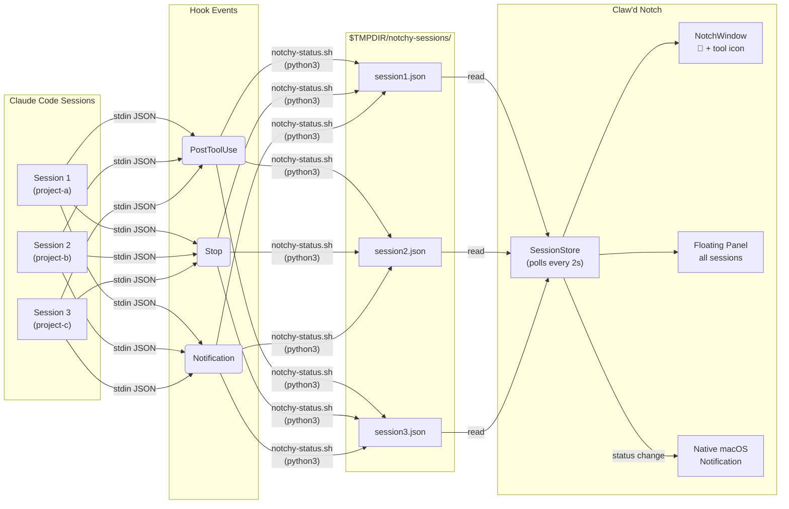

# Claw'd Notch

**Your MacBook notch knows what your AI coding agent is doing.**

A macOS app that turns your MacBook's notch into a live dashboard for your AI coding sessions. Supports **Claude Code** and **GitHub Copilot CLI**. See which session needs your attention, which one is running bash, which one just finished — without leaving your current window.


<p align="center">
  
</p>

## The problem

You're running 4 Claude Code sessions across different projects. One finishes and needs your input. Another is stuck. You're alt-tabbing between terminals like a maniac.

## The fix

Claw'd lives in your notch. Hover to see everything:

- **What each session is doing** — tool name + status, updated in real-time
- **Which ones need you** — "Your turn" when Claude is waiting for input
- **How long ago** — timestamps per session
- **Color-coded** — each project gets a unique color bar
- **Push notifications** — "Claude needs input" / "Task completed" (toggleable)

### The notch

<p align="center">
  
</p>

### Claw'd states

| Claw'd color | Meaning |
|:---:|:---|
| 🟠 Orange | Claude is working |
| 🔵 Blue | Claude finished — your turn |
| 🟢 Green | Task completed |
| ⚫ Gray | No active sessions / idle |

### Notch tool icons

The icon next to Claw'd shows exactly what Claude is doing:

| Icon | Tool | Description |
|:---:|:---|:---|
| `terminal` | Bash | Running shell commands |
| `pencil` | Edit / MultiEdit | Editing files |
| `doc.badge.plus` | Write | Creating new files |
| `eye` | Read | Reading files |
| `magnifyingglass` | Grep | Searching file contents |
| `folder` | Glob | Finding files by pattern |
| `person.2` | Agent | Running subagents |
| `globe` | WebSearch | Searching the web |
| `arrow.down.doc` | WebFetch | Fetching web content |
| `checklist` | Task | Managing tasks |
| `sparkles` | Other | Any other tool |

The icon persists after the task ends (dimmed in gray) so you always see the last thing Claude did.

### Panel session statuses

| Status | Color | Meaning |
|:---:|:---|:---|
| `Your turn` | Blue | Claude is waiting for your input |
| `Bash` / `Edit` / etc. | Yellow | Claude is actively using that tool |
| `Thinking...` | Orange | Working for >60s without a tool call |
| `Done!` | Green | Task just completed |
| `Sleeping` | Gray | Session interrupted |
| `Idle` | Dark gray | No activity |

### Menu bar options

| Option | Default | Description |
|:---|:---:|:---|
| Privacy Mode | ON | Hides Claude's message content from the panel. Shows only tool names |
| Push Notifications | ON | macOS notifications when Claude needs input or completes a task |
| Quit Claw'd Notch | — | Exits the app |

## Supported agents

| Agent | Hook System | Config Location |
|:---|:---|:---|
| **Claude Code** | [Native hooks](https://docs.anthropic.com/en/docs/claude-code/hooks) | `~/.claude/settings.json` |
| **GitHub Copilot CLI** | [CLI hooks](https://docs.github.com/en/copilot/how-tos/copilot-cli/customize-copilot/use-hooks) | `~/.copilot/hooks/` |

The setup wizard lets you choose which agents to install hooks for. You can enable both.

## How it works

Uses each agent's native hooks system. No Accessibility permissions required, no automation entitlements — just local temp files and native macOS notifications:



Each hook event fires the same script (`notchy-status.sh`) which:
1. Reads the hook JSON from stdin (session ID, tool name, working directory)
2. Parses the transcript JSONL for the last assistant message
3. Writes a status JSON to `$TMPDIR/notchy-sessions/{session_id}.json` (per-user, `chmod 700`)

The app polls those files every 2 seconds and sends native macOS notifications on status transitions.

Works with any terminal: Warp, iTerm, Terminal.app, VS Code, tmux, SSH.

## Install

### Download (recommended)

1. Download **[Clawd-Notch.dmg](https://github.com/ohernandezdev/clawd-notch/releases/latest/download/Clawd-Notch.dmg)**
2. Open the DMG, double-click `ClawdNotch.app`
3. It auto-moves to `/Applications` and configures Claude Code hooks
4. You can inspect the hook script and settings changes before accepting

### Build from source

```bash
git clone https://github.com/ohernandezdev/clawd-notch.git
cd clawd-notch
bash install.sh
```

The install script will:
1. Show you exactly what it's going to do
2. Build the app from source
3. Copy it to `/Applications`
4. Back up your `~/.claude/settings.json`
5. Install the hook script to `~/.claude/hooks/`
6. Add hooks to your Claude Code settings (merges with existing config)
7. Launch the app

### Manual install

**1. Build the app**

```bash
git clone https://github.com/ohernandezdev/clawd-notch.git
cd clawd-notch
xcodebuild -project ClawdNotch.xcodeproj -scheme ClawdNotch -configuration Release -derivedDataPath build CODE_SIGN_IDENTITY="-"
cp -r build/Build/Products/Release/ClawdNotch.app /Applications/
```

Or open `ClawdNotch.xcodeproj` in Xcode and hit Cmd+R.

**2. Install the hook**

```bash
mkdir -p ~/.claude/hooks
cp hooks/notchy-status.sh ~/.claude/hooks/notchy-status.sh
chmod +x ~/.claude/hooks/notchy-status.sh
```

**3. Add to Claude Code settings**

Add these hooks to `~/.claude/settings.json`:

```json
{
  "hooks": {
    "PostToolUse": [
      {
        "matcher": "",
        "hooks": [{ "type": "command", "command": "bash ~/.claude/hooks/notchy-status.sh", "timeout": 3 }]
      }
    ],
    "Notification": [
      {
        "matcher": "",
        "hooks": [{ "type": "command", "command": "bash ~/.claude/hooks/notchy-status.sh", "timeout": 3 }]
      }
    ],
    "Stop": [
      {
        "matcher": "",
        "hooks": [{ "type": "command", "command": "bash ~/.claude/hooks/notchy-status.sh", "timeout": 3 }]
      }
    ]
  }
}
```

> If you already have hooks, add these entries alongside your existing ones.

**4. Launch**

```bash
open /Applications/ClawdNotch.app
```

## Requirements

- macOS 15.0+ (notch recommended, works on any Mac via menu bar)
- Claude Code CLI
- Xcode Command Line Tools (for building from source)

## Security & Privacy

- **Developer tool, not sandboxed** — runs outside the App Sandbox to read Claude Code's temp files. No App Store distribution.
- **No network calls** — the app never contacts any server. All data stays on your machine.
- **Local-only storage** — session state in `$TMPDIR/notchy-sessions/` (per-user, `chmod 700`). Nothing persisted long-term.
- **What it reads**: hook event JSON from stdin (session ID, tool name, working directory) and the last ~20KB of the Claude Code transcript.
- **What it writes**: one JSON file per session in `$TMPDIR/notchy-sessions/`.
- **Notifications** are generic ("Claude needs input" / "Task completed") — no message content is ever shown in notifications.
- **Privacy Mode** (on by default) hides Claude's message content from the panel.
- **Secret filtering** — the hook filters common secret patterns (API keys, tokens, JWTs) from any displayed text.
- The install script backs up your `~/.claude/settings.json` before modifying it.

See [SECURITY.md](SECURITY.md) for the full threat model.

## Uninstall

```bash
bash uninstall.sh
```

This will quit the app, remove it from `/Applications`, clean up hooks from `~/.claude/settings.json` (with backup), and delete temp files.

## Credits

- **[Notchy](https://github.com/adamlyttleapps/notchy)** by Adam Lyttle — the original MacBook notch app. This is a fork.
- **[SwiftTerm](https://github.com/migueldeicaza/SwiftTerm)** by Miguel de Icaza — terminal emulator
- **[Claw'd](https://www.starkinsider.com/2025/10/clawd-ai-retro-mascot-command-line.html)** — the Claude Code crab mascot by Anthropic
- Built with [Claude Code](https://claude.ai/code)

## License

[MIT](LICENSE) — Original work copyright Adam Lyttle. Claude Code integration copyright Omar Hernandez.
