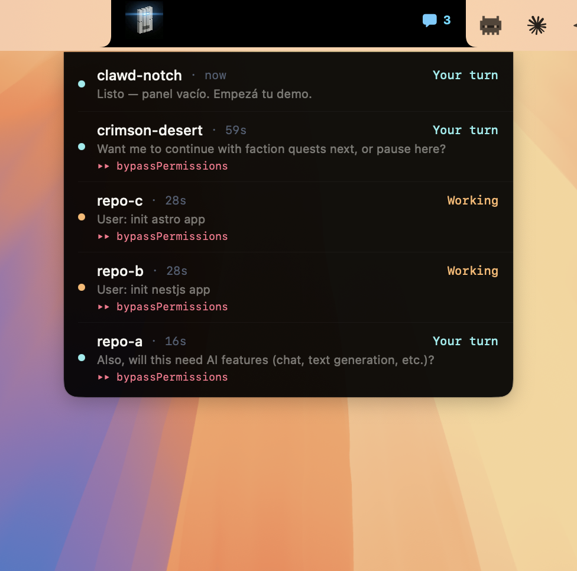
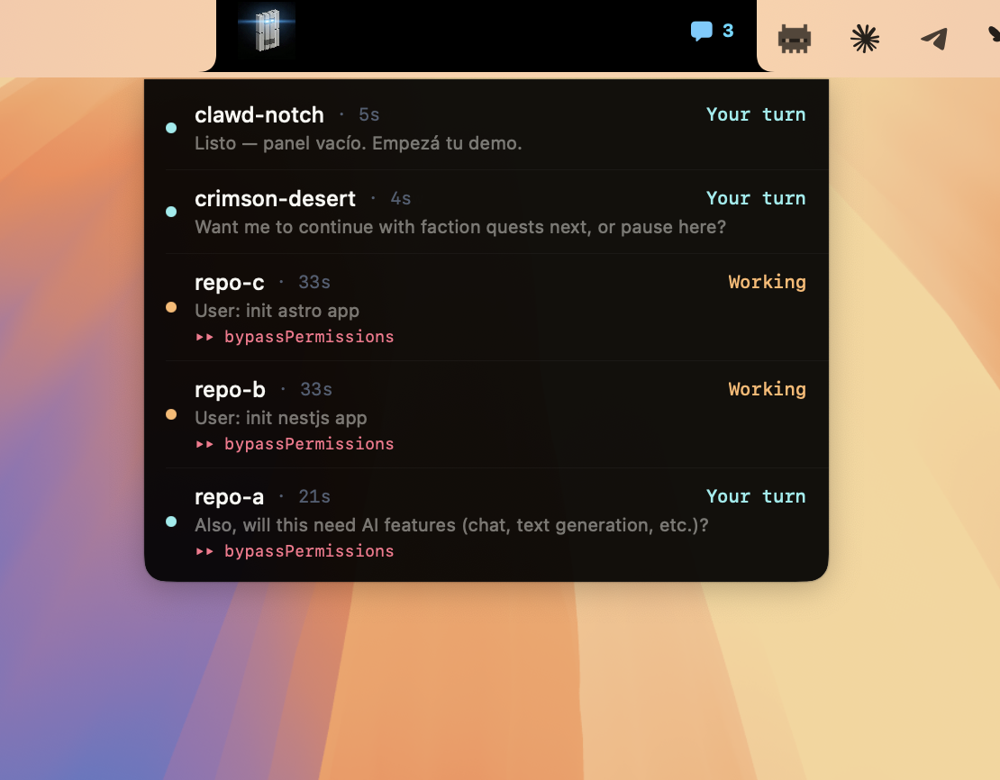
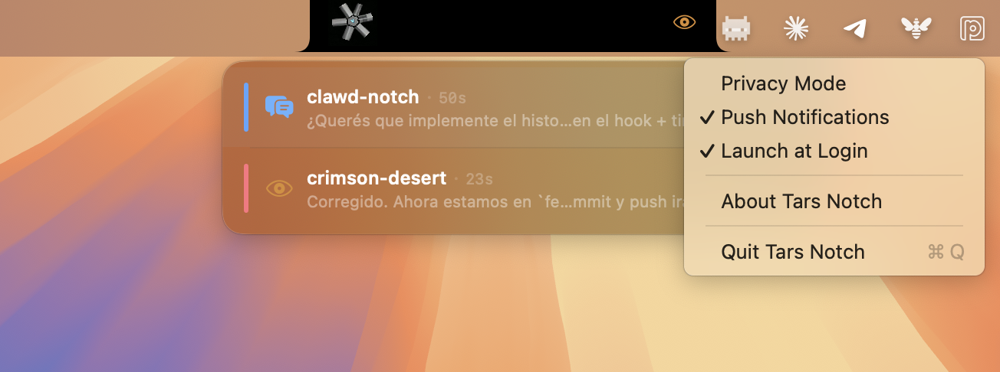

# Tars Notch

**Your MacBook notch knows what your AI coding agent is doing.**

A macOS app that turns your MacBook's notch into a live dashboard for your AI coding sessions. Supports **Claude Code** and **GitHub Copilot CLI**. See which session needs your attention, which one is running bash, which one just finished — without leaving your current window.


<p align="center">
  
</p>

## The problem

You're running 4 Claude Code sessions across different projects. One finishes and needs your input. Another is stuck. You're alt-tabbing between terminals like a maniac.

## The fix

Tars lives in your notch. Hover to see everything:

- **What each session is doing** — tool name + last message, updated in real-time via HTTP (no polling)
- **Which ones need you** — "Your turn" when Claude is waiting for input
- **Approve permissions from the panel** — no need to switch to the terminal
- **Model + mode** — see which model each session runs and if it's in bypass mode
- **Active subagents** — know when agents are running in parallel
- **Push notifications** — "Claude needs input" / "Task completed" (toggleable)

### The notch

<p align="center">
  
</p>

Tarsbot (the pixel art robot) lives in the left side of the notch. The right side shows the current tool icon + a badge with the number of sessions waiting for your input.

### Session statuses

| Status | Color | Meaning |
|:---:|:---|:---|
| `Your turn` | Cyan | Claude is waiting for your input |
| `Bash` / `Edit` / `Read` / etc. | Orange | Claude is actively using that tool |
| `Thinking...` | Yellow | Working for >60s without a tool call |
| `Done` | Green | Task just completed |
| `Paused` | Yellow | Session interrupted |
| `Idle` | Gray | No activity |

### Permission approvals

When Claude needs permission to run a tool, a banner appears in the panel with:
- The tool name and command details
- A countdown progress bar (5 minutes)
- **Allow** / **Deny** buttons

https://github.com/user-attachments/assets/demo-permissions.mov

If you don't respond in 5 minutes, the banner disappears and Claude Code shows its own permission prompt in the terminal.

### Privacy mode

Toggle privacy mode from the menu bar. When on, only tool names are shown (no message content).

https://github.com/user-attachments/assets/demo-privacy.mov

### Menu bar options

<p align="center">
  
</p>

| Option | Default | Description |
|:---|:---:|:---|
| Privacy Mode | ON | Hides Claude's message content from the panel |
| Push Notifications | ON | macOS notifications when Claude needs input or completes a task |
| Launch at Login | OFF | Start Tars Notch when you log in |
| Quit Tars Notch | — | Exits the app |

## Supported agents

| Agent | Hook System | Config Location |
|:---|:---|:---|
| **Claude Code** | [Native hooks](https://docs.anthropic.com/en/docs/claude-code/hooks) | `~/.claude/settings.json` |
| **GitHub Copilot CLI** | Same format (fork of Claude Code) | `~/.copilot/settings.json` |

The setup wizard lets you choose which agents to install hooks for. Both use the same hook script.

## How it works

```
Claude Code / Copilot CLI
    │
    ├─ PostToolUse ──┐
    ├─ Stop ─────────┤
    ├─ Notification ─┤
    ├─ SessionStart ─┤
    ├─ SessionEnd ───┤
    ├─ UserPrompt ───┤    HTTP POST              Tars Notch
    ├─ SubagentStart ┼──► localhost:7483/hook ──► SessionStore ──► Panel + Notch
    ├─ SubagentStop ─┤    (instant)               │
    ├─ PermissionReq ┤                            ├──► Notifications
    │                │    File fallback            │
    │                └──► $TMPDIR/tars-sessions/   └──► Permission approve/deny
    │                     (polled every 2s)
```

The hook script (`tars-status.sh`) runs on every Claude Code event:
1. Receives hook JSON on stdin (session ID, tool name, working directory, etc.)
2. Reads the last assistant message from the transcript
3. **POST**s to `localhost:7483` for instant updates (the app runs a local HTTP server)
4. Also writes a JSON file as fallback if the app isn't running

Works with any terminal: Warp, iTerm, Terminal.app, VS Code, tmux, SSH.

## Install

### Download (recommended)

1. Download **[Tars-Notch.dmg](https://github.com/ohernandezdev/tars-notch/releases/latest/download/Tars-Notch.dmg)**
2. Open the DMG, drag `TarsNotch.app` to Applications
3. Launch — it auto-configures hooks on first run
4. You can inspect the hook script and settings changes before accepting

### Build from source

```bash
git clone https://github.com/ohernandezdev/tars-notch.git
cd tars-notch
bash install.sh
```

The install script will:
1. Ask which agents you use (Claude Code / Copilot CLI / Both)
2. Show you exactly what it will do
3. Build the app from source
4. Copy it to `/Applications`
5. Install the hook script
6. Add hooks to your settings (backs up first, merges with existing config)
7. Launch the app

### Manual install

**1. Build the app**

```bash
git clone https://github.com/ohernandezdev/tars-notch.git
cd tars-notch
xcodebuild -project TarsNotch.xcodeproj -scheme TarsNotch -configuration Release -derivedDataPath build CODE_SIGN_IDENTITY="-"
cp -r build/Build/Products/Release/TarsNotch.app /Applications/
```

**2. Install the hook**

```bash
mkdir -p ~/.claude/hooks
cp hooks/tars-status.sh ~/.claude/hooks/tars-status.sh
chmod +x ~/.claude/hooks/tars-status.sh
```

**3. Add to Claude Code settings**

Add these hooks to `~/.claude/settings.json`:

```json
{
  "hooks": {
    "PostToolUse": [{ "matcher": "", "hooks": [{ "type": "command", "command": "bash ~/.claude/hooks/tars-status.sh", "timeout": 3 }] }],
    "Notification": [{ "matcher": "", "hooks": [{ "type": "command", "command": "bash ~/.claude/hooks/tars-status.sh", "timeout": 3 }] }],
    "Stop": [{ "matcher": "", "hooks": [{ "type": "command", "command": "bash ~/.claude/hooks/tars-status.sh", "timeout": 3 }] }],
    "SessionStart": [{ "matcher": "", "hooks": [{ "type": "command", "command": "bash ~/.claude/hooks/tars-status.sh", "timeout": 3 }] }],
    "SessionEnd": [{ "matcher": "", "hooks": [{ "type": "command", "command": "bash ~/.claude/hooks/tars-status.sh", "timeout": 3 }] }],
    "UserPromptSubmit": [{ "matcher": "", "hooks": [{ "type": "command", "command": "bash ~/.claude/hooks/tars-status.sh", "timeout": 3 }] }],
    "SubagentStart": [{ "matcher": "", "hooks": [{ "type": "command", "command": "bash ~/.claude/hooks/tars-status.sh", "timeout": 3 }] }],
    "SubagentStop": [{ "matcher": "", "hooks": [{ "type": "command", "command": "bash ~/.claude/hooks/tars-status.sh", "timeout": 3 }] }],
    "PermissionRequest": [{ "matcher": "", "hooks": [{ "type": "command", "command": "bash ~/.claude/hooks/tars-status.sh", "timeout": 300 }] }]
  }
}
```

> If you already have hooks, add these entries alongside your existing ones.

**4. Launch**

```bash
open /Applications/TarsNotch.app
```

## Requirements

- macOS 15.0+ (notch recommended, works on any Mac via menu bar)
- Claude Code CLI or GitHub Copilot CLI
- Xcode (for building from source)

## Security & Privacy

- **No network calls** — the app never contacts any server. The HTTP server runs on `localhost:7483` only.
- **Local-only storage** — session state in `$TMPDIR/tars-sessions/` (per-user, `chmod 700`).
- **Privacy Mode** (on by default) hides Claude's message content from the panel.
- **Secret filtering** — the hook filters common secret patterns (API keys, tokens, JWTs).
- **Safe settings merge** — the installer backs up your settings before modifying and only appends hooks.
- **Notifications** are generic ("Claude needs input") — no message content is ever shown in notifications.

See [SECURITY.md](SECURITY.md) for the full threat model.

## Uninstall

```bash
bash uninstall.sh
```

Removes the app, hooks from both Claude Code and Copilot CLI (with backup), and temp files.

## Credits

- **[Notchy](https://github.com/adamlyttleapps/notchy)** by Adam Lyttle — the original MacBook notch app
- **[SwiftTerm](https://github.com/migueldeicaza/SwiftTerm)** by Miguel de Icaza — terminal emulator
- **Tarsbot** — pixel art robot mascot inspired by TARS from Interstellar
- Built with [Claude Code](https://claude.ai/code)

## License

[MIT](LICENSE) — Original work copyright Adam Lyttle. AI agent integration copyright Omar Hernandez.
